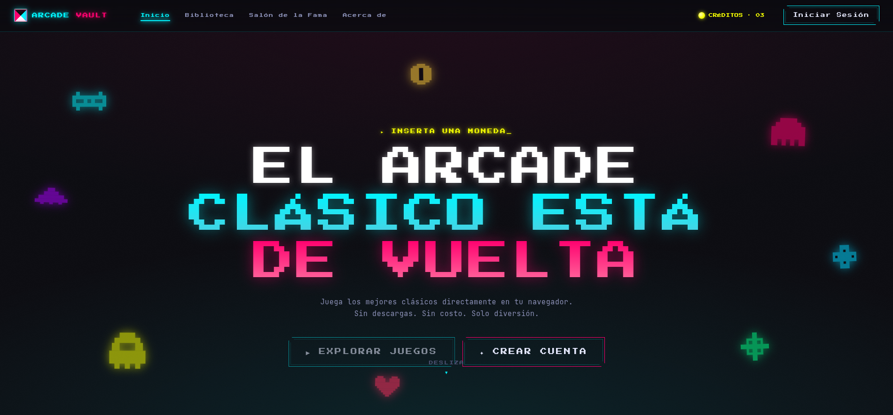

<div align="center">

# 🕹️ ARCADE VAULT

**El arcade clásico está de vuelta.**

Plataforma web para jugar clásicos arcade directamente en el navegador y competir por la mejor puntuación.
Sin descargas. Sin costo. Solo diversión.




</div>

---

## ▸ Qué es

Arcade Vault reúne juegos arcade retro con estética neón y CRT. Cada partida termina con un puntaje que, si iniciaste sesión, entra al **Salón de la Fama** y compite contra el resto de jugadores.

## ▸ Características

- 🎮 **Juegos reales en canvas**: motores en TypeScript montados dentro de una pantalla CRT, con HUD de puntuación, vidas y nivel.
- 🏆 **Ranking persistente**: mejor marca por jugador y juego, guardada en Supabase con Row Level Security.
- 🔐 **Cuentas de jugador**: registro e inicio de sesión con correo y contraseña. También se puede jugar como invitado.
- ⏸️ **Pausa inteligente**: botón, teclas `P` / `Esc` y pausa automática al cambiar de pestaña.
- ✉️ **Formulario de contacto** con envío real de correos mediante Resend.
- 📱 **Diseño responsive** con estética pixel-art y neón.

## ▸ Juegos

| Juego | Estado | Controles |
| --- | --- | --- |
| **ASTEROIDES** | ✅ Jugable | `←` `→` rotar · `↑` propulsar · `Espacio` disparar · `P`/`Esc` pausa |
| CAÍDA, BLOQUE BUSTER, SERPENTINA, GLOTÓN, INVASORES, ROCAS, RANARIA, DUELO PIXEL | 🚧 Demo simulada | — |

**Puntuación de ASTEROIDES:** asteroide grande 20 · mediano 50 · pequeño 100. Recoge el power-up **3x** para disparar en abanico durante 5 segundos.

## ▸ Stack

| Capa | Tecnología |
| --- | --- |
| Framework | Next.js 16 (App Router, Turbopack) |
| UI | React 19 · Tailwind CSS v4 · CSS propio |
| Juegos | HTML5 Canvas + TypeScript (`games/`) |
| Auth y base de datos | Supabase (Auth, Postgres, RLS) |
| Correo | Resend |

## ▸ Empezar

**Requisitos:** Node.js 20+ y un proyecto de Supabase.

```bash
# 1. Instalar dependencias
npm install

# 2. Configurar variables de entorno
cp .env.example .env.local
# Completa los valores de Supabase y Resend

# 3. Aplicar la migración de la base de datos
#    supabase/migrations/20261004000000_profiles_scores.sql

# 4. Levantar el servidor de desarrollo
npm run dev
```

Abre [http://localhost:3000](http://localhost:3000) e inserta una moneda. 🪙

### Variables de entorno

| Variable | Uso |
| --- | --- |
| `NEXT_PUBLIC_SUPABASE_URL` | URL del proyecto de Supabase |
| `NEXT_PUBLIC_SUPABASE_PUBLISHABLE_KEY` | Clave pública de Supabase (la seguridad la da RLS) |
| `RESEND_API_KEY` | API key de Resend (secreta, solo servidor) |
| `CONTACT_TO_EMAIL` | Correo que recibe los mensajes de contacto |
| `CONTACT_FROM_EMAIL` | Remitente de los correos (`onboarding@resend.dev` por defecto) |

> En el dashboard de Supabase desactiva **Authentication → Providers → Email → Confirm email** para que el registro deje la sesión iniciada.

## ▸ Scripts

| Comando | Descripción |
| --- | --- |
| `npm run dev` | Servidor de desarrollo |
| `npm run build` | Build de producción |
| `npm run start` | Sirve el build de producción |
| `npm run lint` | ESLint |

## ▸ Estructura

```
app/            Rutas (inicio, biblioteca, detalle, jugar, salón, login, about, API de contacto)
components/     Componentes de UI (nav, reproductor de juegos, detalle…)
games/          Motores de juego en canvas y registro por id
lib/            Datos del catálogo, sesión, scores y cliente de Supabase
supabase/       Migraciones SQL
specs/          Specs de cada feature (desarrollo guiado por specs)
```

### Agregar un juego

1. Implementa un motor que cumpla el contrato `GameFactory` de `games/types.ts`.
2. Regístralo en `games/registry.ts` con el `id` del juego.
3. Agrega la entrada al catálogo en `lib/data.ts`.

## ▸ Desarrollo guiado por specs

Cada feature nace como un spec en [`specs/`](specs/), con alcance, plan y criterios de aceptación, antes de escribir código.

---

<div align="center">

**HECHO CON PIXELES Y NEÓN** · © 2026 Arcade Vault

</div>
